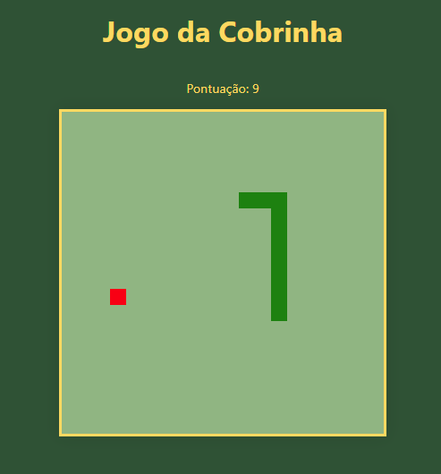

# 🐍 Jogo da Cobrinha

Um jogo simples da cobrinha desenvolvido com HTML5 Canvas e JavaScript.

## Descrição

O Jogo da Cobrinha é um jogo clássico em que o jogador controla uma cobra e deve coletar alimentos para crescer, evitando colidir com as paredes ou com seu próprio corpo. A cada alimento coletado, a cobra aumenta de tamanho e a velocidade do jogo aumenta, tornando o desafio cada vez maior.

## Funcionalidades

- Interface simples e amigável.
- Controle da cobra com as teclas de direção.
- Coleta de alimentos para aumentar a pontuação.
- Aumento de velocidade a cada 5 pontos.
- Reinício do jogo ao colidir com as paredes ou com a própria cobra.

## Como Jogar

1. Clique no texto "Clique para iniciar o jogo!" para começar.
2. Use as setas do teclado (cima, baixo, esquerda, direita) para controlar a direção da cobra.
3. Colete os alimentos para aumentar sua pontuação.
4. Evite colidir com as paredes ou com o próprio corpo da cobra.
5. Ao colidir, clique em "Sim" para reiniciar o jogo.

## Como Executar

Para jogar, basta abrir o arquivo `index.html` em um navegador web compatível com HTML5.

## Próximos Passos

- Adicionar níveis de dificuldade crescente.
- Implementar funcionalidade de recordes (high scores).
- Melhorar a interface do usuário.

## Autor

Este jogo foi criado por Samuel Matsuo.

## Licença

Este projeto está licenciado sob a Licença MIT - veja o arquivo [LICENSE](LICENSE) para mais detalhes.

## Imagens

